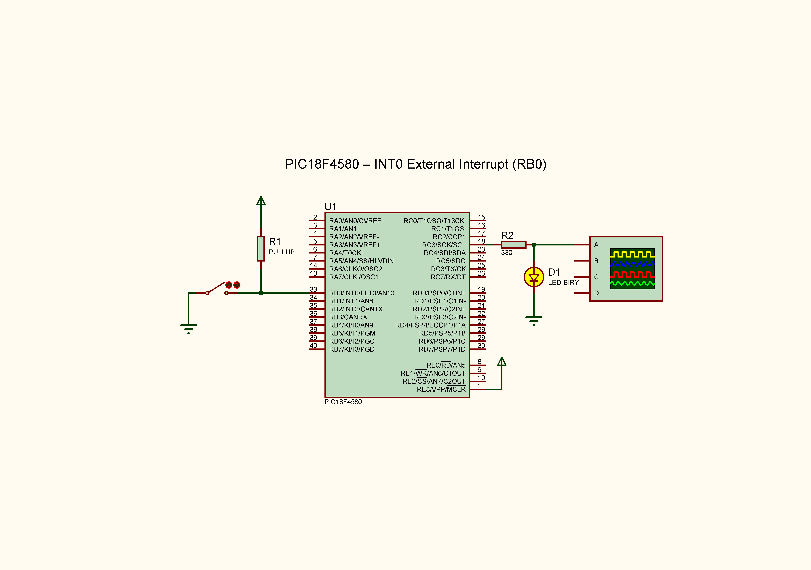
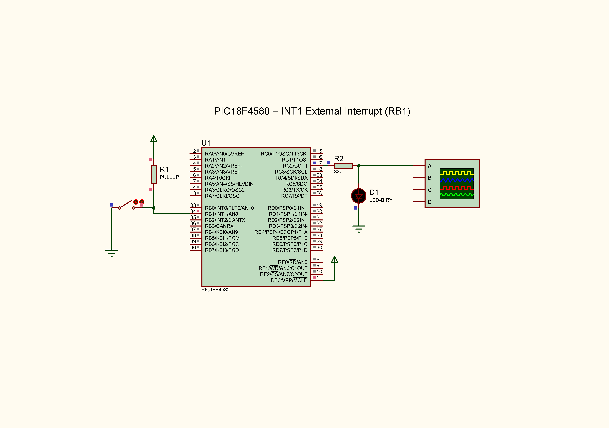
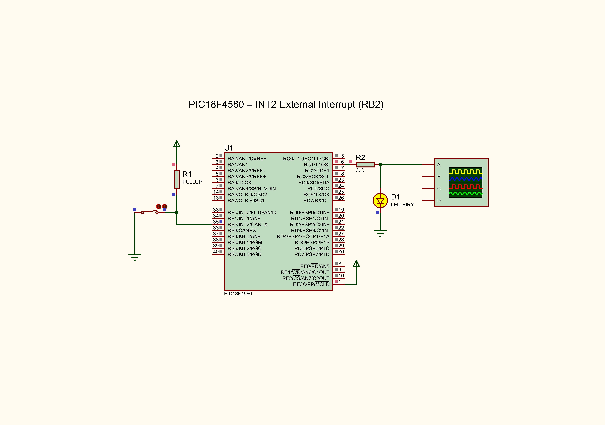

# PIC18F4580 — Proteus Simulation

This folder contains the Proteus project files and exported circuit diagrams for external interrupts on the PIC18F4580 microcontroller.

## 1. INT0 External Interrupt

**Input pin:** RB0/INT0 (Pin 33)

[Proteus Project](ext_intr0.pdsprj)

## 2. INT1 External Interrupt

**Input pin:** RB1/INT1 (Pin 34)

[Proteus Project](ext_intr1.pdsprj)

## 3. INT2 External Interrupt

**Input pin:** RB2/INT2 (Pin 35)

[Proteus Project](ext_intr2.pdsprj)

## Notes

- The PNG files are exported circuit diagrams for viewing on GitHub.
- The project files are provided for use with Proteus.
- The corresponding Embedded C source files are available in the root of this repository.
